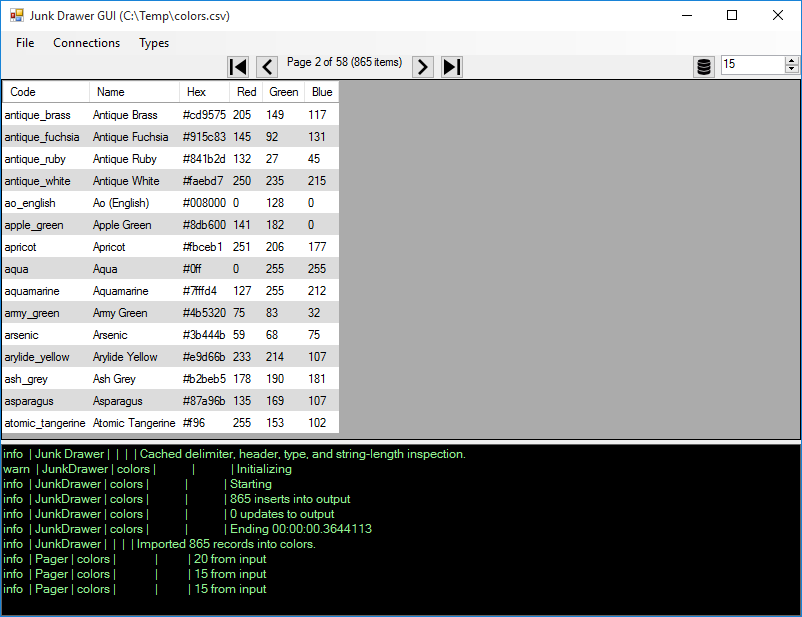

JunkDrawer
==============
JunkDrawer imports excel or delimited files into 
a database.  It is [open source](https://github.com/dalenewman/JunkDrawer) under
Apache 2.

### Introduction

**analyst**: *"Is there something that automatically imports files into a database?"*

**programmer**: *"Use the import wizard."*

The data analyst sighed as he recalled the wizard...


<br/>

Wizarding data into SQL Server goes something like this:

*   Install SQL Server Management Studio.
*   Find Tasks and choose Import Data.
*   Select "Flat File Source."
*   Browse for the file.
*   Preview the data.
*   Specify the delimiter.
*   Specify if the first row is column names.
*   Preview the data (again).
*   Go to each column and choose the correct data type or use "Suggest Types."
*   Choose if you want to save the SSIS package for later.
*   Execute it

**analyst**: *"Is there something that imports the data without asking questions?"*

**programmer**: *"No.  Use the wizard.  If you get an error 
message, fix the problem and try again."*

**analyst**: *"I get a lot of different files.
Using the wizard is repetitive. This wastes my time."*

At this, the programmer shouted assembly language...

**programmer**: *"You come to my cube, without a ticket,
saying YOUR time is being wasted?"*

---

Sadly, this scenario happens a lot in IT offices. Recently, 
while helping a co-worker learn `SQL`, he said:

**staff**: *"SQL is amazing, but how do I get these files
into the database?"*

I thought of the import wizard, but it didn't feel right. 
If he found out he'd have to run the wizard every time, 
and most likely deal with error messages, it would be a 
stumbling block for him.

This gave me the idea to create a program that 
imports an Excel or text file into a database 
without asking questions.


### Getting Started

Junk Drawer refers to files as *junk*, and the 
database as a *drawer*.  The file is an input, and 
the database is an output.  Both are connections. 

To configure connections, open the default configuration file *default.xml*.

```xml
<jd>
  <connections>

    <add name="input" 
         provider="file" 
         file="*.*" />

    <add name="output" 
         provider="sqlserver" 
         server="localhost" 
         database="Junk" />

  </connections>
</jd>
```

The configuration (above) defines two connections: an input, and an output.
The input is set to a file named `*.*`, which is changed to your 
file at run-time. The output is set to a local SQL Server database named Junk. 

### The File Input

The file must be an Excel (e.g. `.xls`, `.xlsx`), or delimited 
text file (e.g. `.csv`, `.txt`).

I Googled `filetype:csv colors` and found [colors.csv](https://github.com/codebrainz/color-names/blob/master/output/colors.csv) for this demo.

Here's a sample of *colors.csv*:

```bash
Code,Name,Hex,Red,Green,Blue
air_force_blue_raf,"Air Force Blue (Raf)",#5d8aa8,93,138,168
air_force_blue_usaf,"Air Force Blue (Usaf)",#00308f,0,48,143
air_superiority_blue,"Air Superiority Blue",#72a0c1,114,160,193
alabama_crimson,"Alabama Crimson",#a32638,163,38,56
alice_blue,"Alice Blue",#f0f8ff,240,248,255
alizarin_crimson,"Alizarin Crimson",#e32636,227,38,54
alloy_orange,"Alloy Orange",#c46210,196,98,16
almond,"Almond",#efdecd,239,222,205
...
```

### Command Line

To import the file, execute Junk Drawer with the `-f` (file) flag:

```bash
jd.exe -f c:\temp\colors.csv
```

If a file is the only argument, `-f` is optional. It's only required 
when combined with other options exposed to the command line interface.

When `jd.exe` is done, the data is in your local SQL Server 
and it may be queried:

```sql
USE Junk;

SELECT TOP 10 Code, Name, Hex, Red, Green, Blue
FROM colors;
```

```bash
Code                  Name                   Hex     Red Green Blue
--------------------- ---------------------- ------- --- ----- ----
air_force_blue_raf    Air Force Blue (Raf)   #5d8aa8 93  138   168
air_force_blue_usaf   Air Force Blue (Usaf)  #00308f 0   48    143
air_superiority_blue  Air Superiority Blue   #72a0c1 114 160   193
alabama_crimson       Alabama Crimson        #a32638 163 38    56
alice_blue            Alice Blue             #f0f8ff 240 248   255
alizarin_crimson      Alizarin Crimson       #e32636 227 38    54
alloy_orange          Alloy Orange           #c46210 196 98    16
almond                Almond                 #efdecd 239 222   205
amaranth              Amaranth               #e52b50 229 43    80
amber                 Amber                  #ffbf00 255 191   0
```

The `colors` object is a view.  The data columns are defined like so:

```sql
Code NVARCHAR(40),
Name NVARCHAR(42),
Hex NVARCHAR(8),
Red TINYINT,
Green TINYINT,
Blue TINYINT
```

### How Does it Work?

When we glance at *colors.csv* above, it's easy for us
to see the first row is a header, and subsequent 
rows are records.

Moreover, we see that a _comma_ delimits the values.  We 
also recognize patterns with the fields.  We see that `Code`, 
`Name`, and `Hex` are text, and `Red`, `Green`, and `Blue` 
are numeric.

Junk Drawer has to see the same thing as we do:

1. the delimiter
2. the column names (if available)
3. the column data types

### Finding the Delimiter
 
100 lines are examined for delimiters. If delimiters
are found, the average number per line and [standard
deviation](http://www.mathsisfun.com/data/standard-deviation.html)
is calculated.

Then, the delimiter with the lowest [coefficient
of variation](http://en.wikipedia.org/wiki/Coefficient_of_variation)
is declared winner.  This provides us with the most 
consistent delimiter across the first 100 records.

The default delimiters searched for are comma, pipe, tab, and semicolon. 
If you want control over the delimiters, configure them in 
the input connection like this:

```xml
<add name="input" provider="file" file="*.*">
  <delimiters>
     <add name="comma" character=","/>
     <add name="pipe" character="|"/>
     <add name="tab" character="&#009;"/>
     <add name="semicolon" character=";"/>
  </delimiters>
</add>
```

### Column Names

The first line is split by the winning delimiter 
and tested for:

* duplicates
* empties
* white space values
* numbers
* dates

If there are any of the above, the first line is not suitable 
for column names and Excel-like names are generated (i.e. A, B, C). 
In *colors.csv*, the first line doesn't have any 
duplicates, empties, white space values, numbers, or dates, 
so it is used as column names.

### Data Types

Initially, every field is considered a `string`. 
Often, when importing a file for ad-hoc queries, 
strings are fine. However, if you want to *type-check* 
the data, add types into the input connection like this: 

```xml
<add name="input" provider="file" file="*.*">
    <types>
        <add type="bool"/>
        <add type="byte"/>
        <add type="short"/>
        <add type="int"/>
        <add type="long"/>
        <add type="single"/>
        <add type="double"/>
        <add type="decimal"/>
        <add type="datetime"/>
    </types>
</add>
```

Types are checked in the order they appear. So, to select the 
most efficient type, place more restrictive types ahead of less restrictive types. 
For example, if you test for a `short` (-32,768 to 32,767), before a `byte` (0 to 255), 
any *would-be* `bytes` end up as `shorts`.

Every value in a field is checked against a type's restrictions. 
The first compatible type is used. If no type allows all the values, 
a `string` is used.

A string's length is measured. A field assumes the length 
of the longest value in the file (+1). If you want control 
over string length, add `min-length` and/or `max-length` to 
the connection:

```xml
<add name="input" 
     provider="file" 
     file="*.*"
     min-length="64"
     max-length="4000" />
```

Once the values are type and/or length checked, Junk Drawer
imports the file

### In Code

JunkDrawer may be used in code like this:

```csharp
JunkResponse response;
var request = new JunkRequest(@"c:\temp\colors.csv");
using (var scope = new AutofacJunkBootstrapper(request)) {
    response = scope.Resolve<JunkImporter>().Import();
}

```
The above snippet uses [Autofac](http://autofac.org) to wire up 
the `JunkImporter` dependencies.  A `JunkDrawer.Autofac` project 
is included in the solution.

### Options

#### View Name
By default, Junk Drawer creates a view named after your 
file (without the extension).  For example, `colors.csv` is 
named `colors`. If you want to name your view something else, 
set the `View` property in the `JunkRequest` or use the `-v` 
flag from the command line.

#### Configuration

If you do not provide a configuration, *default.xml* is used.

The configuration is file based. You may make as 
many configurations as you want.  For example, 
to import into SQLite instead of SQL Server, create 
a configuration like this:

```xml
<jd>
  <connections>
    <add name="input" provider="file" file="*.*" />
    <add name="output"
         provider="sqlite"
         file="c:\temp\junk.sqlite3" />
  </connections>
</jd>
```

Save it as *sqlite.xml*.  Now import *colors.csv* into 
a SQLite database:

`jd.exe -f c:\temp\colors.csv -a sqlite.xml`

The `-a` flag stands for *arrangement*. You can control 
everything from the arrangment (aka configuration). In addition, 
you over-ride some options from the command line.  Here is the 
complete list:

```bash
-f, --file           Required. The file to import.
-a, --arrangement    The configuration file (default.xml).
-t, --types          Override the configuration inspection types, comma
                     separated (e.g. bool, byte, short, int, long, single,
                     double, datetime).
-c, --connection     Override the configuration connection type (e.g.
                     sqlserver, mysql, postgresql, sqlite, sqlce).
-s, --server         Override the configuration output server.
-n, --port           Override the configuration output port.
-d, --database       Override the configuration output database.
-v, --view           Override the configuration output view.
-u, --user           Override the configuration output user.
-p, --password       Override the configuration output password.
--help               Display this help screen.
```

### GUI

If you'd rather use a GUI (a graphical user-interface), you may 
use `jdgui.exe`.  It looks like this:



In addition to importing files into databases, you can page through 
the data a bit.  Any connections you define in addition to `input` are 
listed in the connections menu.  This allows you to 
conveniently switch between connections you use often (just 
in case you have junk everywhere).

### Precautions

#### Junk Overwrite

If you import the same file into Junk Drawer twice, it overwrites 
the previous table.  Don't worry though; it's only junk ;-)

#### Junk Overflow

I called it Junk Drawer because allowing folks to 
import files directly into a database can create a mess. 
You may want to keep an eye on it, or put your Junk database 
on an isolated test server where it can't hurt anything.

### Conclusion

Once in place, Junk Drawer empowers your trusted
friends to import their data into a Junk database
and run ad-hoc queries until their heart's content.

Of course, there are files out there that are so 
jacked up that Junk Drawer won't be able handle them. 
In that case, you'll have to resort to the import wizard.

### Credits

Junk Drawer is not possible without:

* [Microsoft .NET](https://www.microsoft.com/net)
* [AutoFac](http://autofac.org/) - MIT
* [Dapper](https://github.com/StackExchange/dapper-dot-net) - Apache 2
* [FileHelpers](http://www.filehelpers.net/) - MIT
* [ExcelDataReader](https://github.com/ExcelDataReader/ExcelDataReader) - MIT
    * [SharpZipLib](https://icsharpcode.github.io/SharpZipLib/) - GNU
* [Nlog](http://nlog-project.org/) - BSD
* [Cfg-Net](https://github.com/dalenewman/Cfg-NET) - Apache 2
* [Command Line Parser](https://github.com/gsscoder/commandline) - MIT
* [System.Data.SQLite](https://system.data.sqlite.org)
* [Npgsql](http://www.npgsql.org/)
* [MySql.Data](http://dev.mysql.com/downloads/connector/net/)- GPL 2
* [ETO.Forms](https://github.com/picoe/Eto) - Custom
* [Transformalize](https://github.com/dalenewman/transformalize) - Apache 2 