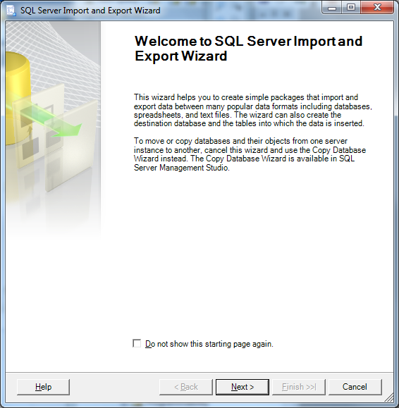
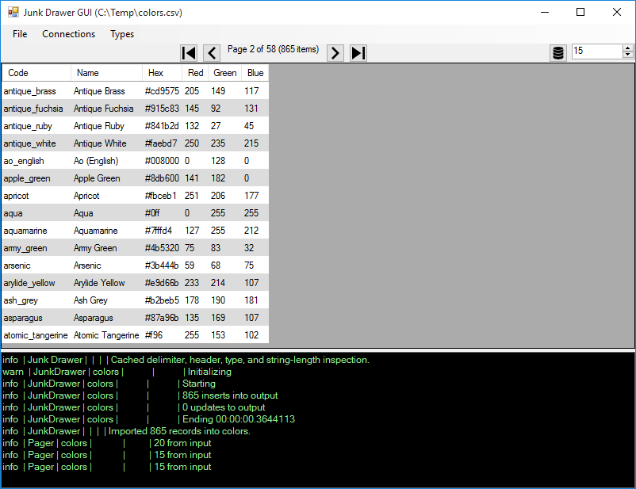

# JunkDrawer

JunkDrawer imports delimited text and Excel files into a database, then lets you browse the result in a desktop app or run the import from a terminal. The modernized projects use .NET 10 and [Transformalize](https://github.com/dalenewman/Transformalize).

## Introduction

**analyst**: *"Is there something that automatically imports files into a database?"*

**programmer**: *"Use the import wizard."*

The data analyst sighed as he recalled the wizard...



Wizarding data into SQL Server goes something like this:

* Install SQL Server Management Studio.
* Find Tasks and choose Import Data.
* Select "Flat File Source."
* Browse for the file.
* Preview the data.
* Specify the delimiter.
* Specify if the first row is column names.
* Preview the data (again).
* Go to each column and choose the correct data type or use "Suggest Types."
* Choose if you want to save the SSIS package for later.
* Execute it.

**analyst**: *"Is there something that imports the data without asking questions?"*

**programmer**: *"No. Use the wizard. If you get an error
message, fix the problem and try again."*

**analyst**: *"I get a lot of different files.
Using the wizard is repetitive. This wastes my time."*

At this, the programmer shouted assembly language...

**programmer**: *"You come to my cube, without a ticket,
saying YOUR time is being wasted?"*

---

Sadly, this scenario happens a lot in IT offices. Recently,
while helping a co-worker learn `SQL`, he said:

**staff**: *"SQL is amazing, but how do I get these files
into the database?"*

I thought of the import wizard, but it didn't feel right.
If he found out he'd have to run the wizard every time,
and most likely deal with error messages, it would be a
stumbling block for him.

This gave me the idea to create a program that
imports an Excel or text file into a database
without asking questions.

Junk Drawer refers to files as *junk*, and the database as a *drawer*.
The file is an input, and the database is an output. Both are connections.

I called it Junk Drawer because allowing folks to import files directly into
a database can create a mess. You may want to keep an eye on it, or put your
Junk database on an isolated test server where it can't hurt anything.

## Current status

- CSV, TXT, XLS, and XLSX input to SQLite pass local integration tests on macOS arm64.
- SQL Server, PostgreSQL, and MySQL import and paging pass local Testcontainers tests on macOS arm64. CI repeats them on Linux x64.
- The shared Eto GUI and Windows launcher compile. The Eto Mac64 host launches and imports on this Mac without an extra workload. An additional native macOS host builds with the `macos` .NET workload and still needs its own launch check.
- Access and SQL Server Compact are no longer supported. Existing arrangements using them must select a supported output provider.

## Build and test

Install the .NET 10 SDK. On macOS or Windows, run from the repository root:

```sh
dotnet restore JunkDrawer.sln
dotnet build JunkDrawer.sln
dotnet test --project Test/Test.csproj
```

To run the server integration tests, start Docker and run `dotnet test --project Test.Database/Test.Database.csproj`. The tests create disposable PostgreSQL, MySQL, and SQL Server containers; SQL Server uses x64 emulation on Apple Silicon.

`JunkDrawer.sln` shows all nine projects, including the Windows and macOS desktop launchers. The default solution build includes the portable libraries, CLI, shared GUI, and tests; build a desktop launcher separately on its own OS using the commands below.

## CLI

The SQLite example writes `junk.sqlite3` in the current working directory:

```sh
dotnet run --project JunkDrawer.Console/JunkDrawer.Console.csproj -- \
  -f Test/Files/CommaSeparatedValues.csv -a JunkDrawer.Console/sqlite.xml
```

On Windows PowerShell, put the command on one line. Run `dotnet run --project JunkDrawer.Console/JunkDrawer.Console.csproj -- --help` for all options. A single filename also works. A nonexistent input exits with code 1; invalid flags exit with code 2. With no `-a`, the CLI uses the shared arrangement lookup described below; the bundled SQLite example is its final fallback.

An arrangement defines an `input` and one or more output connections. The GUI lists the named outputs:

```xml
<jd>
  <connections>
    <add name="input" provider="file" file="*.*" />
    <add name="output" provider="sqlite" file="junk.sqlite3" />
    <add name="scratch" provider="sqlite" file="scratch.sqlite3" />
  </connections>
</jd>
```

The output file path is relative to the process working directory. Use an absolute path when invoking the CLI from another directory. For server databases, edit the corresponding example arrangement and pass credentials at runtime or through a private arrangement; do not commit passwords. The CLI prints the generated query after importing.

### Personal arrangements

Keep your connection settings in `~/.junkdrawer/config.xml` (or `~/.junkdrawer/sqlite.xml`). Both the CLI and GUI read the same XML format. Start with the SQLite example, then add named output connections under `<connections>`; the GUI lists every connection except `input` in its Connections menu.

```sh
mkdir -p ~/.junkdrawer
cp -n JunkDrawer.Console/sqlite.xml ~/.junkdrawer/config.xml
```

The default lookup checks `config.xml` and then `sqlite.xml` in each location, in this order: the process working directory, the application directory, and `~/.junkdrawer`. If none exists, it uses the bundled `Examples/sqlite.xml`. This keeps the bundled example from hiding your personal file. The apps do not pick an arbitrary XML file automatically because the choice would be ambiguous; select another filename with `-a path/to/work.xml` or set `JUNKDRAWER_CONFIG` to its path. An explicit selection takes precedence and reports an error if the file is missing. A bare filename is searched in the same three directories. Paths beginning with `~/` or `~\` expand to the current user's home directory on macOS, Linux, and Windows, including connection `file` values. A bare `~` also expands; `~otheruser` does not. Relative output paths such as `file="junk.sqlite3"` still use the process working directory, so use `file="~/.junkdrawer/junk.sqlite3"` for a stable personal database location.

## Desktop GUI

The GUI shares one form across native Eto backends. It can open a file, import it in the background, browse pages with a selectable page size, show the current page query, switch among arrangement connections, and choose inspection types. Use the File, Connections, and Types menus to open files and choose settings. File > Settings opens the active arrangement XML in its associated application. The SQL icon beside the paging controls toggles the lower pane between logs and the current page query. The divider between the data grid and lower pane can be dragged to resize either pane. The SQL view formats Transformalize's query using the connection's SQL dialect, with the formatter's default SQL dialect for SQLite. The GUI uses the personal arrangement lookup above and accepts `-a path/to/work.xml` to select another arrangement at launch. Restart it after editing the XML.



The earlier Windows GUI pictured above shows the data grid and activity log. The current GUI keeps those views and uses the database icon button to switch the lower pane between logs and SQL.

On this arm64 Mac, run the Mac64 host without an extra workload:

```sh
./scripts/run-mac.sh
```

You can pass a file path as the first argument, for example `./scripts/run-mac.sh Test/Files/CommaSeparatedValues.csv`, or select an arrangement with `./scripts/run-mac.sh -a ~/.junkdrawer/work.xml Test/Files/CommaSeparatedValues.csv`. The script builds and starts the generated local `.app` directly. Eto's Mac64 package currently generates a `dotnet run` path with Windows separators on this setup, so use the script.

The additional native macOS backend can be built after installing the macOS workload:

```sh
sudo dotnet workload install macos
dotnet build JunkDrawer.Eto.Core.Desktop/JunkDrawer.Eto.Core.Desktop.csproj
```

On Windows, install the .NET 10 SDK and build the Windows host:

```powershell
dotnet run --project JunkDrawer.Eto.WinForms/JunkDrawer.Eto.WinForms.csproj
```

The Windows host must be launched on Windows. There is no downloadable app package or signing flow yet.

## Docker CLI image

Build locally for your machine:

```sh
docker build -f JunkDrawer.Console/Dockerfile -t junkdrawer-cli .
docker run --rm -v "$PWD:/data" junkdrawer-cli -f /data/Test/Files/CommaSeparatedValues.csv
```

The container runs from `/data`, so a writable bind mount stores `junk.sqlite3` on the host. Mount CSV/Excel files, arrangements, and output paths into the container and use container paths in CLI arguments. For a database on the host, use `host.docker.internal` where supported; for another container, use a shared Docker network. Supply credentials through a private mounted arrangement or CLI flags rather than baking them into an image.

GitHub Actions builds and smoke tests native `linux/amd64` and `linux/arm64` images by digest, then creates one GHCR manifest. The regular .NET runtime image is the supported variant. Alpine is deferred until musl and globalization testing passes. Desktop builds are CI checks only; the workflow does not publish desktop downloads.

## Packaging and changes

The reusable package IDs are `JunkDrawer` (`netstandard2.0`) and `JunkDrawer.Autofac` (`net10.0`). See [packaging](docs/packaging.md) for local pack and manual publishing steps, and [changelog](CHANGELOG.md) for migration changes. The [modernization plan](modernize-plan.md) tracks remaining validation work.
